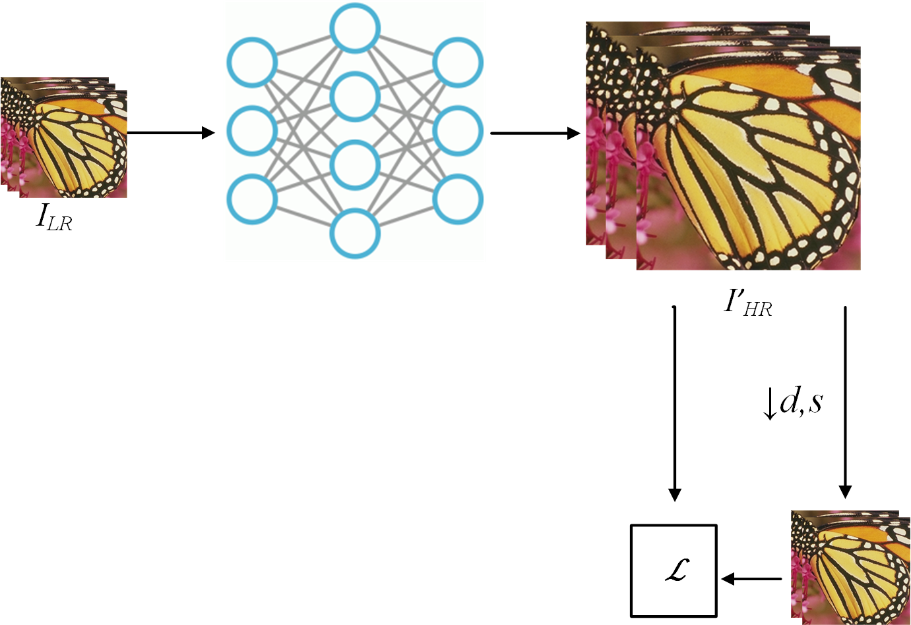

# Blind image super-resulution using self-supervised learning
Проект в рамках дисциплины "Проектный семинар" AI Talent Hub ИТМО.

## Поставновка задачи
Blind image super-resolution – восстановления изображения в высоком разрешении $I_{HR}$ из изображения в низком разрешении $I_{LR}$ при условии неизвестного метода деградации $F_D$. Изображения $I_{HR}$ на этапе обучения также недоступны. Таким образом, формально задачу можно представить в виде:  
$I_{LR} = F_D(I_{HR}, s)$, где  
$I_{HR}$ - $HR$ image,  
$F_D$ - degradation function,  
$I_{LR}$ - source $LR$ image,  
$s$ - scale factor

## Предлагаемая методика
Классическим способом является использование имеющегося $LR$ изображния в качестве $HR$, а $LR$ "пара" формируется путем уменьшения размера исходного $LR$ в $s$ раз. Очевидно, при таком подходе "новое" $LR$ изображение будет содержаться деталей еще меньше, чем исходное. В противовес данному подходу в рамках проекта предлагается подход, в котором обучающими парами являются ${LR - HR'}$, где $HR'$ построенное сетью $HR$ изображение, который далее даунсемплится в масштабе $s$ и участвует в расчете loss в качестве таргета к исходному $LR$:

  

$\mathcal {L} = \alpha $ $ L_2(I_{LR},I'_{LR}) + \beta SSIM(I_{LR},I'_{LR}) + \gamma TV(I'_{HR}),

$\alpha$ =, $\beta$ =, $\gamma$ =  
$I'_{LR}= \downarrow _s [I'_{HR} \otimes k]$,  
$s$ - scale factor  

$\mathcal {L} = \alpha L_2 (I_{LR}, I'_{LR}) + \beta SSIM (I_{LR},)$
