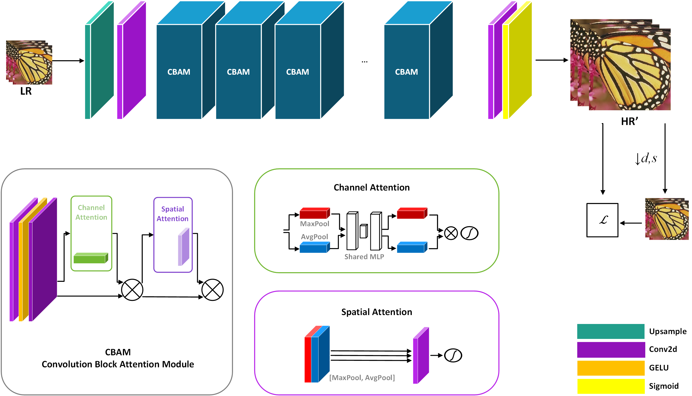
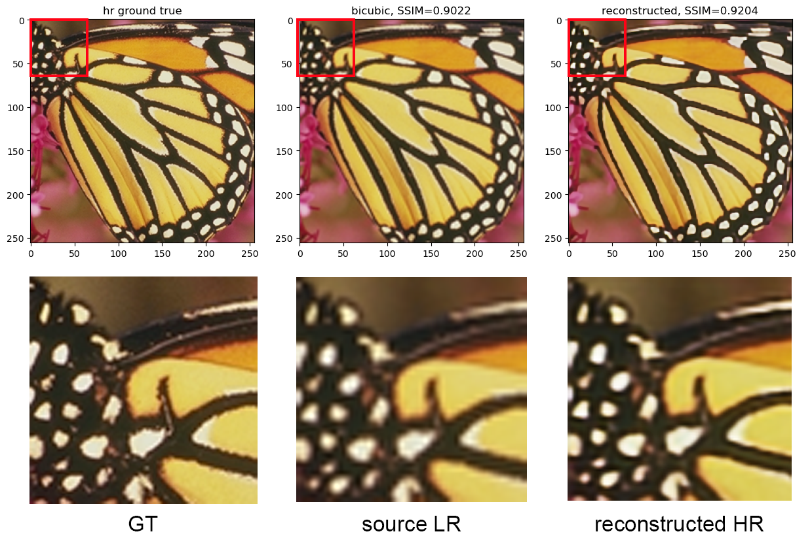
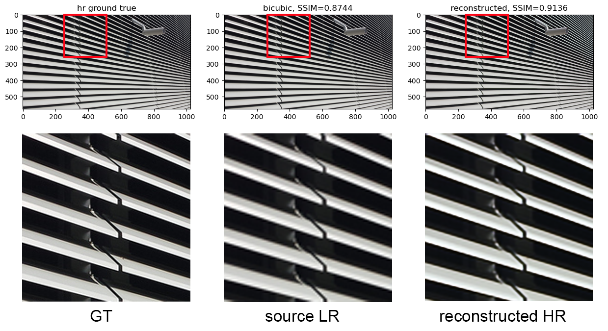

# Blind image super-resulution using self-supervised learning
Проект в рамках дисциплины "Проектный семинар" AI Talent Hub ИТМО.

## Поставновка задачи
Blind image super-resolution – восстановления изображения в высоком разрешении $I_{HR}$ из изображения в низком разрешении $I_{LR}$ при условии неизвестного метода деградации $F_D$. Изображения $I_{HR}$ на этапе обучения также недоступны. Таким образом, формально задачу можно представить в виде:  

$I_{LR} = F_D(I_{HR}, s)$, где  
$I_{HR}$ - $HR$ image,  
$F_D$ - degradation function,  
$I_{LR}$ - source $LR$ image,  
$s$ - scale factor

## Предлагаемая методика
Классическим способом является использование имеющегося $LR$ изображния в качестве $HR$, а $LR$ "пара" формируется путем уменьшения размера исходного $LR$ в $s$ раз. Очевидно, при таком подходе "новое" $LR$ изображение будет содержаться деталей еще меньше, чем исходное. В противовес данному подходу в рамках проекта предлагается подход, в котором обучающими парами являются ${LR - HR'}$, где $HR'$ построенное сетью $HR$ изображение, который далее даунсемплится в масштабе $s$ и участвует в расчете loss в качестве таргета к исходному $LR$:

  

$\mathcal {L} = \alpha L_2 (I_{L}, I'_{L}) + \beta SSIM (I_L, I'_L) + \gamma TV(I'_H)$ , где  

$\alpha$ =, $\beta$ =, $\gamma$ =  
$I'_L = \downarrow _s [I'_H \otimes k]$,  
$s$ - scale factor,  
$k$ - ядро размытия.

## Эксперименты и обучение 

Коэффициенты компонентов лосс функции, а также гиперпараметры сети подбирались экспериментально. Подробно с результатами можно ознакомится в   . Итоговый вариант сети представляет собой архитектуру, представленную на рисунке ниже:

 

Для обучение сети использовался датасет [RealSRv3](https://www.kaggle.com/datasets/yashchoudhary/realsr-v3) из статьи [Toward real-world single image super-resolution: A new benchmark and a new model](https://arxiv.org/abs/1904.00523). Особенностью его является тот факт, что в отличие от большинства датасетов, используемых в задачах SR, изображение LR в нем сформированы не синтетически, путем даусемпла из HR версий, а при помощи съемки с разными фокусными расстояниями и дальнейшим выравниванием полученных снимков таким образом, чтобы границы каждого изображения в наборах «HR-LRx2, HR-LRx3, HR-LRx4» были идентичными.

Обучение сети производилось на 40 эпохах, LR - 0.001, оптимизатор - Adamax. Использована ГПУ Nvidia RTX 3060.
Тестирование производилось на бенчмарках Set5, Urban100

## Результаты

 
 
